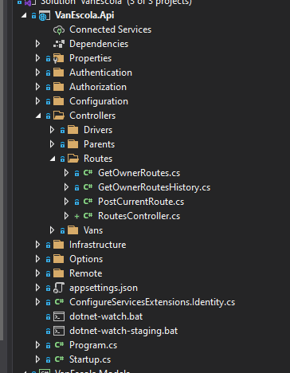

# Proposta de boas práticas de rotas e controllers

## Rotas atuais

<details open>
<summary>Lista atual de rotas e controllers do VanEscola</summary>

### VansController

- GET Parents/Vans
  - policy: parent
  - return vans w/ studentIds

### VanOwnerController

- GET parent/vanowner
  - policy: parent
  - return vanowner data (business name, userid and phonenumber)

### VanController

- POST van/locations-rnbg
  - policy: driver
  - send locations to mobiltracker
- POST van/mtk-endpoint
  - policy: público
  - receive locations from mobiltracker
- GET van
  - policy: driver
  - vanId e nome da van do motorista
- DELETE van/current-route
  - policy: driver
  - deleta current-route
- POST van/current-route
  - policy: driver
  - cria current-route

### UserController

- GET user =>
  - legacy
  - policy: Driver
  - returns user
  - talvez não seja mais usado
- GET driver/user
  - policy: Driver
  - retorna userId, email e username do motorista
- GET parent/user
  - policy: Parent
  - retorna nome e phonenumber do pai
- GET owner/user
  - policy: Owner
  - retorna userId, nome, phone e businessName do owner
- PUT owner/user
  - policy: Owner
  - atualiza nome e businessName
- POST registration
  - policy: público
  - cadastra Owner
- PUT activation
  - policy: público
  - ativa owner
- PUT recover-password
  - policy: público
  - manda e-mail de recuperação de senha
- PUT reset-password
  - policy: público
  - reseta a senha do usuário
- PUT change-password
  - policy: owner
  - muda a senha do owner
- PUT resend/registration
  - policy: público
  - reenvia e-mail de ativação de conta

### StudentsController

- GET students
  - legacy
  - policy: Driver
  - redirect para get students as driver
- GET owner/students
  - policy: Owner
  - get students of owner
- GET driver/students
  - policy: Driver
  - get students of driver
- GET parent/students
  - policy: Parent
  - get students of parent
- POST owner/student
  - policy: Owner
  - create student
- PUT owner/student/{id}
  - policy: Owner
  - update student name, school and isActive
- POST owner/parents/{parentId}/students/{studentId}
  - policy: Owner
  - create parent-student relationship
- DELETE owner/parents/{parentId}/students/{studentId}
  - policy: Owner
  - delete parent-student relationship
- DELETE owner/student/{studentId}
  - policy: Owner
  - delete student

### SchoolsController

- GET schools
  - policy: Driver
  - legacy redirect to get school as driver
- GET driver/schools
  - policy: Driver
  - get schools from the driver's owner
- GET owner/schools
  - policy: Owner
  - get schools from owner
- POST owner/schools
  - policy: Owner
  - create school
- PUT owner/schools/{schoolId}
  - policy: Owner
  - update school
- DELETE owner/schools/{schoolId}/delete
  - policy: Owner
  - delete school
- GET parent/schools
  - policy: Authorize
  - get schools from parent students

### RoutesController

- GET routes
  - policy: Driver
  - retorna todos templates de rotas daquela vanId
- POST routes
  - policy: Driver
  - cria template de rota
- PUT routes/{routeId}
  - policy: Driver
  - atualiza rota
- DELETE routes/{routeId}
  - policy: Driver
  - deleta rota
- POST routes/{routeId}/events
  - policy: Driver
  - cria evento de rota
- PUT {routeId}/route-students ou {routeId}/route-items
  - policy: Driver
  - adiciona item a rota
- GET owner/routes
  - policy: Owner
  - retorna rota de todas vans

### ReportsController

- GET reports
  - policy: Driver
  - retorna resumo de atividades de responsáveis

### ParentsController

- GET owner/parents
  - policy: Owner
  - retorna parents do owner
- POST owner/parent
  - policy: Owner
  - cria parent
- PUT owner/parent/{id}
  - policy: Owner
  - atualiza parent
- DELETE owner/parent/{parentId}
  - policy: Owner
  - deleta parent

### NotificationController

- GET notifications/messages
  - policy: Parent
  - retorna todas as notificações de um pai
- PUT notifications/seen
  - policy: Parent
  - atualiza todas notificações para vistas

### DriversController

- GET Owner/Drivers
  - policy: Owner
  - retorna os drivers do owner
- GET Parent/Drivers
  - policy: Parent
  - retorna os drivers do parent

### AuthController

- POST auth/token
  - policy: Público
  - loga o usuário
- DELETE auth/ticket
  - policy: Authorize
  - deleta login
- POST auth/ticket
  - policy: Público
  - loga com authticket
- POST password
  - policy: Driver
  - muda password do driver
- PUT auth/registration-id
  - policy: Authorize
  - altera registrationId do usuário

</details>

## Padronização

### Vocabulário

#### Entidade

Objeto do banco de dados, parcialmente equivalente ao que seria uma linha da tabela.

Exemplos:

- Tracker
- User
- Alert

#### Atributo

Propriedade de um objeto do banco de dados, equivalente ao que seria uma coluna de uma linha da tabela.

Exemplos:

- IsActive (do Tracker)
- IsOnline (do Tracker)
- Seen (do Notification)

### Controller

Um controller deve ser responsável por uma única entidade. Toda atualização e leitura dessa entidade deve estar nesse controller.

#### Nomenclatura

Nome do controller: [Entitades]Controller (sempre no plural)

Exemplos:

- VansController
- StudentsController
- SchoolsController
- RoutesController
- ParentsController
- ReportsController
- DriversController

Modificações:

- VanOwnerController => OwnersController
- VanController => VansController
- UserController => UsersController
- criação do RouteEventsController (para rota de Post route/{id}/events que está no RoutesController)
- criação do CurrentRouteController (para rota de POST e DELETE van/current-route)
- NotificationController => NotificationsController

Exceções / o que fazer?

- AuthController
  - Não existe um conceito de "Auths" no banco de dados, é uma aglomeração de diferentes formas de login e autorização de aplicativos

#### Implementação

O controller deve se encontrar em: controllers/[entidades]/[entidades]Controller.cs

É importante que ele seja implementado como uma partial class para que cada rota seja implementada como uma extensão do controller em um arquivo próprio.

```c#
// Exemplo para um EntitiesController.cs no projeto VanEscola.Api
using Microsoft.AspNetCore.Mvc;
using VanEscola.Models;


namespace VanEscola.Api.Controllers
{
    public partial class EntitiesController : Controller
    {
        public EntitiesController(AppDbContext dbContext)
        {
            this.DbContext = dbContext;
        }

        public AppDbContext DbContext { get; private set; }
    }
}
```

### Rotas

#### Estrutura de pastas

Cada rota deve ser um arquivo cujo nome reflete sua rota e método e deve se encontrar na pasta do seu controller.

|  |
| :-----------------------------------------------------------------------: |
|            <b>Exemplo de projeto nessa estrutura de pastas</b>            |

#### Perfis

No caso da API VanEscola, existem diferentes perfis de usuários que chamarão cada rota. Se a rota for um limitada para um perfil específico, o perfil deve prefixar a rota.

Exemplo:

- GET driver/user
- GET parent/user
- GET owner/user
- POST registration (pública)

Modificações:

- GET parents/vans => GET parent/vans
- GET van => GET driver/van
- POST/DELETE van/current-route => POST/DELETE driver/current-route
- Remover GET User (já existe GET driver/user)
- PUT change-password => PUT owner/change-password
- Remover GET Students (já existe GET driver/students)
- Remover GET Schools (já existe GET driver/schools)
- GET/POST/PUT/DELETE routes => GET/POST/PUT/DELETE driver/routes
- POST routes/{routeId}/events => POST driver/route-event
- PUT {routeId}/route-students ou PUT {routeId}/route-items => PUT driver/route/{routeId}/items
- GET reports => GET driver/reports
- GET notifications/messages => GET parent/notifications
- PUT notifications/seen => PUT parent/notifications/seen
- POST password => POST driver/change-password

Exceções / o que fazer?:

- POST van/locations-rnbg (chamada apenas por driver)

#### Padrões comuns de rotas

### GET [Entidades]

Retorna uma lista com os dados de todas as entidades.

Exemplos:

- GET driver/students
- GET parent/students
- GET driver/schools
- GET owner/parents
- GET notifications/messages

### GET [Entidade]

Retorna a única entidade relacionada ao usuário que a chamou.

Exemplos:

- GET van
- GET parent/user
- GET owner/user
- GET driver/user

### POST [Entidade]

Cria uma entidade.

Exemplos:

- POST van/current-route
- POST owner/student
- POST owner/parent

Modificações:

- POST owner/schools => POST owner/school
- POST routes => POST route

### DELETE [Entidade]

Deleta entidade do usuário (quando existe apenas uma entidade do usuário).

Exemplos:

- DELETE van/current-route
- DELETE auth/ticket

### DELETE [Entidade]/{entidade-id}

Deleta entidade com entidade-id (quando podem existir múltiplas entidades de um mesmo usuário).

Exemplos:

- DELETE owner/student/{studentId}
- DELETE owner/parent/{parentId}

Modificações:

- DELETE owner/schools/{schoolId}/delete => DELETE owner/schools/{schoolId}
- DELETE routes/{routeId} => DELETE route/{routeId}

### PUT [Entidade]

Atualiza dados da entidade do usuário (quando existe apenas uma entidade do usuário).

Exemplos:

- PUT owner/user

### PUT [Entidade]/{entidade-id}

Atualiza os dados de uma entidade com entidade-id (quando podem existir múltiplas entidades de um mesmo usuário).

Exemplos:

- PUT owner/student/{student-id}
- PUT owner/parent/{parentId}

Modificações:

- PUT owner/user => PUT owner/user/{user-id}
- PUT owner/schools/{schoolId} => PUT owner/school/{schoolId}
- PUT routes/{routeId} => PUT route/{routeId}

### PUT [Entidade]/{entidadeId}/[Propriedade]

Atualiza uma propriedade da entidade.

Exemplo:

- [NENHUM]

Modificações:

- PUT {routeId}/route-students => route/{routeId}/students

### PUT [Entidades]/[Propriedade]

Atualiza uma propriedade de várias entidades.

Exemplo:

- PUT notifications/seen
